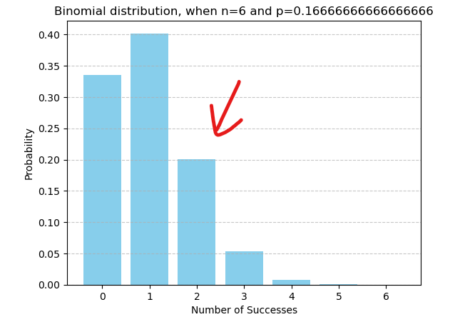
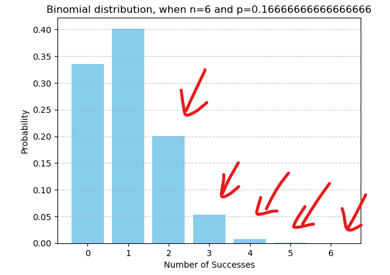
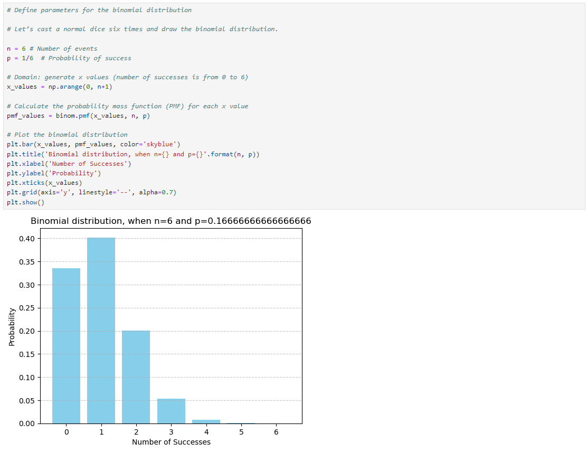

# {index}`Binomial distribution`
The binomial distribution is a discrete probability distribution that describes the number of positive outcomes in a fixed number of independent events, where each event has the same probability of success. In other words, it models the number of positive outcomes, denoted by $k$, out of a fixed number of independent events (or experiments), denoted by $n$, where each experiment can result in either success or failure.

> Key characteristics of the binomial distribution include
>
> - **Binary Outcomes**: Each event can result only in one of two outcomes: postivive or negative / success or failure / ture or false etc.
>
> - **Independent Trials**: The events are independent of each other, meaning the outcome of one event does not influence the outcome of another.
>
> - **Constant Probability**: The probability of success is constant for each event. In other words, the probability does not change between events.

The probability of event $A$ happening exactly $k$ times out of $n$ is given by the **discrete probability density function**, also knwon as the **mass function of the binomial distribution**, the **PMF**. The formula looks like

$P(A=k) = \binom{n}{k} p^k (1 - p)^{n - k}$, where

- $\binom{n}{x}$ is here called as the **binomial coefficient**, also known as the **k-combinations of n**, which represents the number of ways to choose $k$ successes out of $n$ events
- $p$ is the probability of success in each event
- $(1 - p)$ is the probability of failure in each trial, sometimes denoted by $q = (1 - p)$ and
- $n$ is the total number of events.

So the formula can be interpretated kind of as the product of $\text{combinations} \times \text{successes} \times \text{failures}$.
<br></br>

**Example.** Let's cast a normal dice six times. What is the probability of getting exactly two sixes?

Here $k=2$, $n=6$ and $p=\frac{1}{6}$. Let's substitute this in the discrete probability density function.

$\begin{align}P(A=2) &= \binom{6}{2} \cdot (\frac{1}{6})^2 \cdot (1 - \frac{1}{6})^{6 - 2} \\ \\
&= \binom{6}{2} \cdot (\frac{1}{6})^2 \cdot (\frac{5}{6})^4 \\ \\
&= 15 \cdot \frac{1}{36} \cdot \frac{625}{1296} \\ \\
&= \frac{3125}{15552} \\ \\
&= 0.200 \ldots \end{align}$

Looking at the values we can say that there are 15 different ways (combinations) of getting two sixes, one sixth of a change of getting a six on a cast and five sixth of a change of not getting a six.

```{figure-md} bin_distr_example1


Binomial distribution of casting a dice six times - what is the probability of getting exactly two sixes
```
<br></br>

**Example.** Let's cast a normal dice six times. What is the probability of getting at least two sixes?

So the favourable events are getting two, three, four, five or six times sixes. We could count these separately and by the addition rule, add them together.

```{figure-md} bin_distr_example2


Binomial distribution of casting a dice six times - what is the probability of getting at least two sixes
```

However, it would more efficient to use the complement. The complement of 'at least two sixes' is 'no sixes or one six'. So we can write

$\begin{align}P(\text{at least two sixes}) &= 1 - P(\text{zero or one sixes}) \\ \\
&= 1 - (\binom{6}{0} \cdot (\frac{1}{6})^0 \cdot (1 - \frac{1}{6})^{6 - 0} + \binom{6}{1} \cdot (\frac{1}{6})^1 \cdot (1 - \frac{1}{6})^{6 - 1})\\ \\
&= 1 - (1 \cdot 1 \cdot (\frac{5}{6})^6 + 6 \cdot \frac{1}{6} \cdot (\frac{5}{6})^5)\\ \\
&= \frac{12281}{46656} \\ \\
&= 0.263 \ldots \end{align}$
<br></br>

:::{admonition} EXERCISE 1. More rolls of the dice
:class: tip, dropdown
How does the change is getting two sixes change if we have less rolls of the dice? Think about the outcome first and then give an example.
:::

:::{admonition} EXERCISE 2. Basketball
:class: tip, dropdown
Lauri Markkanen, a Finnish basketball player for Utah Jazz, has a free throw shooting percentage of 88.4 % in season 2023-2024. (source: <a href="https://www.nba.com/stats/player/1628374" target="_blank">NBA stats</a>).

a) In a game, he attempts 10 free throws. What is the probability that he makes exactly 8 of them?

b) What is the probability that he makes at most 7 of them?
:::

Binomial distribution can be plotted and the result can be seen from the graph.

:::{admonition} Code for plotting the binomial distribution
:class: note, dropdown
```{figure-md} bin_distr_Python


Code for plotting a binomial distribution
```
:::
<br></br>

The **mean** of the binomial distribution is given by

$\text{mean} = np$, where

- $n$ is the total number of events and
- $p$ is the probability of success in each event.

So, the product $np$ gives us the expected number of successes (or positive outcomes) in $n$ events.
<br></br>

**Example.** How many times is is expected to get the number six out of six casts?

When $n=6$ and $p=\frac{1}{6}$, we get

$\begin{align}\text{mean} &= np \\ \\
&=6 \cdot \frac{1}{6} = 1 \end{align}$
<br></br>

The **variance**, denoted by $\sigma^2$, of the binomial distribution is given by

$\sigma^2 = np(1 - p)$

Variance describes how much the values vary from the mean, so it gives us information about the spread of the distribution. If $p$ is close to 0 or 1, meaning the probability of success or failure is very low or very high, the variance tends to be smaller. If $p$ is closer to 0.5, indicating a more balanced probability of success and failure, the variance tends to be larger.
<br></br>

**Example.** What is the variance for this case?

When $n=6$ and $p=\frac{1}{6}$, we get

$\begin{align}\sigma^2 &= np(1 - p) \\ \\
&=6 \cdot \frac{1}{6} \cdot (1 - \frac{1}{6}) = \frac{5}{6} \end{align}$
<br></br>

:::{admonition} EXERCISE 3. Multiple-choice test
:class: tip, dropdown
In a multiple-choice test, each question has 4 options, of which only one is correct. To pass a test, a student must gain at least one third of the questions correct.

a) If a student guesses the answer to each question, what is the probability that the student passes a test of 16 questions?

b) What is the expected number of correct answers when quessing?

c) Calculate the variance.
:::
<br></br>

The **standard deviation**, denoted by $\sigma$, is another important measure of spread or dispersion. 

For the binomial distribution, the standard deviation is the square root of the variance.

$\sigma = \sqrt{np(1-p)}$

The standard deviation measures the average distance of the data points from the mean. It tells us how much individual data points in the distribution typically deviate from the mean. A larger standard deviation indicates greater variability in the data (a broader distribution), while a smaller standard deviation indicates less variability (a narrow distribution).