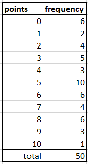
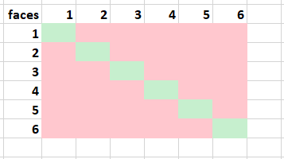

# {index}`General definitions of probability`
For introduction, let's compare how statistical and classical probabilites relate to each other.

<iframe scrolling="no" title="Nopan_heittoa" src="https://www.geogebra.org/material/iframe/id/srqwbybn/width/600/height/500/border/888888/sfsb/true/smb/false/stb/false/stbh/false/ai/false/asb/false/sri/false/rc/false/ld/false/sdz/true/ctl/false" width="600px" height="500px" style="border:0px;"> </iframe>

Source: <a href="https://ggbm.at/humATwzb" target="_blank">Huippu, Otava</a>

## {index}`Statistical definition of probability`
Probabilities can be calculated based on experimental observations. The simplest example of such a probability is based on empirical or experimental data, known as **statistical probability**. In this case, the probability of an event is the same as the relative frequency of the corresponding statistical variable.

:::{admonition} Definition
Statistical definition of probability is denoted by
$P(A)=\frac{f_A}{n}$
where $f_A$ is the frequency of the event and $n$ is the number of observations.
:::

:::{admonition} EXERCISE 1. Statistics of Darts
:class: tip, dropdown
A dartboard is a circular ring target, where in the center of the board is a circle with a point value of 10. Surrounding this circle are numbered rings from 9 to 1, as well as an unnumbered border.

<p><a href="https://commons.wikimedia.org/wiki/File:Tikkataulu.JPG#/media/Tiedosto:Tikkataulu.JPG"></a><br><a href="https://creativecommons.org/licenses/by-sa/3.0" title="Creative Commons Attribution-Share Alike 3.0">CC BY-SA 3.0</a>, <a href="https://commons.wikimedia.org/w/index.php?curid=8103163">Linkki</a></p>

Below are statistics of some darts practise.
```{figure-md} darts


Statistics of 50 darts throws.
```
What is the probability that the score of a single throw is even?

<p style="text-align: right; font-style: italic;"> Answer: 0.52 </p>
:::

:::{admonition} EXERCISE 2. Jari 'The King' Litmanen #10
:class: tip, dropdown
The greatest Finnish football player is undisputedly Jari Litmanen. The probability that Litmanen scores once in a match 30 % and twice is 10 %. However, Litmanen doesn't score more than twice. What is the probability that Litmanen scores at least once in a match?

<p style="text-align: right; font-style: italic;"> Answer: 0.40 </p>
:::

## {index}`Classical definition of probability`
The classical definition of probability is based on equally likely outcomes in a universal set. According to this definition:

$P(A) = \frac{\text{number of favourable outcomes for event A}}{\text{total number of possible outcomes}}$

This definition assumes that all outcomes in the sample set are equally likely. It is commonly used in situations where each elementary outcome is equally likely to occur, such as in the tossing of a fair coin or a six-sided dice.
<br></br>

**Example.** Two six-sided dices are thrown. What are the odds that the dices have the same face?

Let's denote $A$ = 'dices have the same face' = 'faces are ones OR faces are twos OR ... OR faces are six's'.

The favourable events are $\{1,1\}$, $\{2,2\}$, $\{3,3\}$, $\{4,4\}$, $\{5,5\}$ and $\{6,6\}$ so the number of favourable events is 6. When applying the multiplication principle, the total number of possible outcomes is $6 \cdot 6=36$.

This can be visualized by sketching all the possible combinations.

```{figure-md} dices


All the combinations of two six-sided dices, where green cells represent the favourable events.
```

Therefore, $P(A) = \frac{6}{36} = \frac{1}{6}$

:::{admonition} EXERCISE 3. Balls in a box
:class: tip, dropdown
There are 4 blue, 1 yellow, and 3 red balls in a box. One ball is randomly drawn from the box. What is the probability that the ball is
a) blue
b) yellow
c) not red?

<p style="text-align: right; font-style: italic;"> Answers: a) $\frac{1}{2}$ </p>
<p style="text-align: right; font-style: italic;"> b) $\frac{1}{8}$ </p>
<p style="text-align: right; font-style: italic;"> c) $\frac{5}{8}$ </p>
:::

:::{admonition} EXERCISE 4. Dial Home Device from Stargate
:class: tip, dropdown
A Dial Home Device (DHD in short) consist of 19 glyphs on the inner circle and 19 glyphs on the outer circle. The device opens a wormhole through a ring called Stargate to a distant planet in our Milky Way galaxy, where, let's say, one million planets are habitable and have a stargate.

<a title="Promethee33127, Eric Heunthep, CC BY-SA 3.0 &lt;https://creativecommons.org/licenses/by-sa/3.0&gt;, via Wikimedia Commons" href="https://commons.wikimedia.org/wiki/File:DHD_2.png"></a>

To dial an address, seven glyphs must be pressed in a spesific order and one glyph can be selected only once.

What is the possibility that a randomly chosen address will open a wormhole to a planet?

<p style="text-align: right; font-style: italic;"> Answer: $1.6 \cdot 10^{-5}$ </p>
:::

## {index}`Geometrical definition of probability`
For introduction...

<iframe scrolling="no" title="Grains in flowerbed" src="https://www.geogebra.org/material/iframe/id/tnhfnm8n/width/600/height/470/border/888888/sfsb/true/smb/false/stb/false/stbh/false/ai/false/asb/false/sri/false/rc/false/ld/false/sdz/true/ctl/false" width="600px" height="470px" style="border:0px;"> </iframe>

Source: <a href="https://www.geogebra.org/m/SUPFr8qC#material/xgTuTpJX" target="_blank">Huippu, Otava</a>

:::{admonition} EXERCISE 5. Stone is thrown
:class: tip, dropdown
A stone is being randomly thrown on an area of land, which has the shape of a rectangle and the dimensions are 4 metres and 6 metres. In the middle of the area is a circular pond with the radius of 2 meters. What is probability that the stone hits the pond?

<p style="text-align: right; font-style: italic;"> Answer: 0.52 </p>
:::

:::{admonition} EXERCISE 6. Darts - again
:class: tip, dropdown
<p><a href="https://commons.wikimedia.org/wiki/File:Tikkataulu.JPG#/media/Tiedosto:Tikkataulu.JPG"></a><br><a href="https://creativecommons.org/licenses/by-sa/3.0" title="Creative Commons Attribution-Share Alike 3.0">CC BY-SA 3.0</a>, <a href="https://commons.wikimedia.org/w/index.php?curid=8103163">Linkki</a></p>

The diameter of the dartboard is 341 mm, measured from the outer edge of the number one (1). The diameter of the ten (10) is 35 mm, and the width of the rings is 17 mm.

Let's assume in questions a) and b) that the darts will hit some number.

a) What is the probability that a randomly thrown dart will hit at least nine?

b) Five darts are thrown on each turn. What is the probability that the total points of a turn is at least 49?

c) The possibility to miss the dartboard is 5 %. What is the probability that all five darts will hit at most two?

<p style="text-align: right; font-style: italic;"> Answers: a) 0.036 </p>
<p style="text-align: right; font-style: italic;"> b) $ 6.9 \cdot 10^{-10}$ </p>
<p style="text-align: right; font-style: italic;"> c) 0.0092 </p>
:::