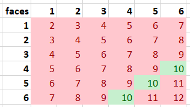
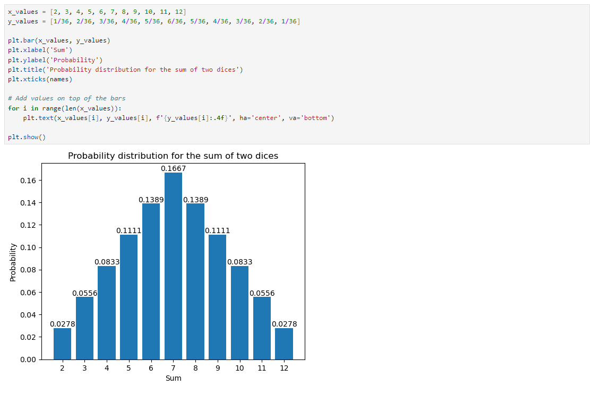

# {index}`Discrete probability distribution`
A binomial distribution is actually a special case of a discrete probability distribution since the probability is constant across all the events. When the probability varies across repetitions, the mean (the expected value) is determined by considering all possible values of the random variable, denoted as $x_i$. Each value is multiplied by its respective probability, $p_i$, and the products are then summed together.

$\text{mean} = \sum_i^{}p_ix_i$

$\text{variance} = \sum_i^{}p_i(x_i-\text{mean})^2$

If each of the individual probabilities, $p_i$, are plotted, the discrete probability distribution is called a **discrete probability density function** (or a probability mass function, PMF). A discrete random variable is one that can take on a countable number of distinct values. For each possible value of the random variable, the PMF gives the probability of observing that value.

> Key properties of a discrete probability density function include:
> 
> - For all possible values of $x_i$, the probability is non-negative, i.e $p_i \geq 0$.
>
> - The sum of the probabilities for all possible values of $x_i$ equals 1: $\sum_{i} p_i = 1$.
<nr></br>

**Example.** Two six-sided dices are thrown. What is the probability that the sum of the dices is 10?

```{figure-md} sum of two dices


All the combinations for the sum of two dices, where green cells represent the favourable events.
```

By classical probability, we can compute that

$P(\text{the sum of two dices is 10})=\frac{3}{36}=\frac{1}{12}$

If we draw a distribution of all the possible sums, we have to count the probabilites separately. A Python code could look like this:

```{figure-md} sum of two dices in a distribution


All the combinations for the sum of two dices, where green cells represent the favourable events.
```