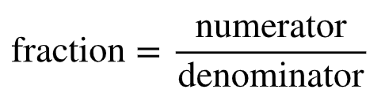

# Fractions

```{figure-md} fraction


The top number is called a numerator and the bottom number is called s denominator.
```

## Multiplication of fractions

We start with the multiplication of fractions, because it is the simplest and the easiest to evaluate (and since we need it later in finding a common denominator).

To calculate the product of fractions, just multiply the numerators and denominators separately.

$\frac{a}{c}\cdot\frac{b}{d}=\frac{a\cdot b}{c\cdot d}=\frac{ab}{cd}$, where $a{,}b{,}c{,}d\ \in\mathbb{Z}$

**Example**

$\frac{5}{8}\cdot\frac{3}{10}=\frac{5\cdot3}{8\cdot10}=\frac{15}{80}$ but the product is not yet simplified. Always remember to simplify!

We can simplify the final product as
$\frac{15}{80}=\frac{3\cdot5}{16\cdot5}=\frac{3}{16}$

but usually it makes things a bit easier to simplify already before that.

$\frac{5}{8}\cdot\frac{3}{10}=\frac{5\cdot3}{8\cdot10}=\frac{1\cdot3}{8\cdot2}=\frac{3}{16}$


## Division of fractions

To calculate the quotient of fractions, change the division into multiplication by using the reciprocal (or inverse) of the divisor.

$\frac{a}{c}:\frac{b}{d}=\frac{a}{c}\cdot\frac{d}{b}=\frac{a\cdot d}{c\cdot b}=\frac{ad}{cb}$ , where $a{,}b{,}c{,}d\ \in\mathbb{Z}$

**Example**

$\frac{3}{8}:\frac{9}{4}=\frac{3}{8}\cdot\frac{4}{9}=\frac{3\cdot4}{8\cdot9}=\frac{1\cdot1}{2\cdot3}=\frac{1}{6}$


## Addition of fractions

### Like fractions
if the denominators are the same, only add the numerators together.

$\frac{a}{c}+\frac{b}{c}=\frac{a+b}{c}$, where $a{,}b{,}c\ \in\mathbb{Z}$

**Example**

$\frac{1}{7}+\frac{4}{7}=\frac{1+4}{7}=\frac{5}{7}$

### Unlike fractions
if the denominators are not the same, find the common denominator. This can be achieved by using a equation of

$\frac{a}{c}+\frac{b}{d}=\frac{ad+cb}{cd}$, where $a{,}b{,}c{,}d\ \in\mathbb{Z}$

but usually it is not the simplest way.

**Example**

$\frac{2}{3}+\frac{1}{9}$

Method 1. Using the equation

$\frac{2}{3}+\frac{1}{9}=\frac{2\cdot9+3\cdot1}{3\cdot9}=\frac{18+3}{27}=\frac{21}{27}=\frac{3\cdot7}{3\cdot9}=\frac{7}{9}$

Method 2. Using your own skills

Here the least common multiple of 3 and 9 is 9, because $3\cdot3=9$ and $1\cdot9=9$. So we multiply the first fraction by a whole fraction  $\frac{3}{3}$.

$\frac{2}{3}+\frac{1}{9}=\frac{3}{3}\cdot\frac{2}{3}+\frac{1}{9}
             =\frac{3\cdot2}{3\cdot3}+\frac{1}{9}
             =\frac{6}{9}+\frac{1}{9}
             =\frac{7}{9}$

A common multiple of the denominators can always be found by multiplying the denominators together. You can always use this trick to find a common multiple of the denominators, but then you usually have to simplify the fraction later.

A common multiple of 3 and 9 can be found by multiplying them together: $3\cdot9=27$. So we multiply the first fraction by a whole fraction of $\frac{9}{9}$ and the second by a whole fraction of $\frac{3}{3}$.

$\frac{2}{3}+\frac{1}{9}=\frac{9}{9}\cdot\frac{2}{3}+\frac{3}{3}\cdot\frac{1}{9}$

$=\frac{9\cdot2}{9\cdot3}+\frac{3\cdot1}{3\cdot9}$

$=\frac{18}{27}+\frac{3}{27}$

$=\frac{18+3}{27}$

$=\frac{21}{27}$

$=\frac{7}{9}$


## Subtraction of fractions 

### Like fractions
just like in the case of addition, if the denominators are the same, only subtract the numerators.

$\frac{a}{c}-\frac{b}{c}=\frac{a-b}{c}$, where $a{,}b{,}c\ \in\mathbb{Z}$

**Example**

$\frac{3}{4}-\frac{5}{4}=\frac{3-5}{4}=\frac{-2}{4}=-\frac{1}{2}$ Always remember to simplify your answer!

### Unlike fractions
if the denominators are not the same, again find the common denominator.

$\frac{a}{c}-\frac{b}{d}=\frac{ad-cb}{cd}$, where $a{,}b{,}c{,}d\ \in\mathbb{Z}$

**Example**

$\frac{2}{5}-\frac{1}{3}$

Method 1. Using the equation

$\frac{2}{5}-\frac{1}{3}=\frac{2\cdot3-5\cdot1}{5\cdot3}=\frac{6-5}{15}=\frac{1}{15}$

Method 2. Using your own skills

Here the least common multiple of 5 and 3 is 15, because $3\cdot5=15$ and $5\cdot3=15$. So we multiply the first fraction by a whole fraction of $\frac{3}{3}$ and the second by a whole fraction of $\frac{5}{5}$.

$\frac{2}{5}-\frac{1}{3}=\frac{3}{3}\cdot\frac{2}{5}-\frac{5}{5}\cdot\frac{1}{3}$
              
$=\frac{3\cdot2}{3\cdot5}-\frac{5\cdot1}{5\cdot3}$
              
$=\frac{6}{15}-\frac{5}{15}$
            
$=\frac{6-5}{15}$
              
$=\frac{1}{15}$