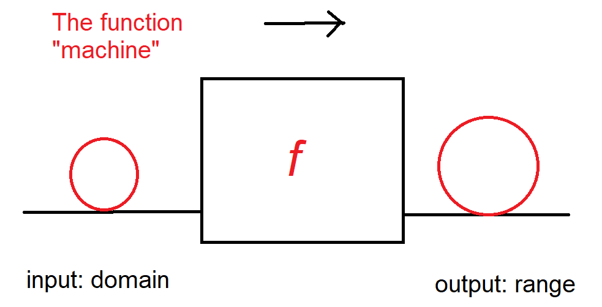

# Functions

```{figure-md} A "function" factory


The input to the factory is called the *range* and the output is called the *domain*.
```

## Linear functions

(figures are missing)

Linear functions in the form of  $f(x)=ax+b$ are lines in (x,y)-plane, where $a,b\in\mathbb{R}$, and the coefficient $a$ is called the slope and the constant term $b$ is the value of the intersection point with y-axis.

The slope, the coefficient in front of the variable $x$, determines if our function is increasing or decreasing one, or horizontal (parallel with the x-axis).
> - if $a > 0$, the function is increasing
> - if $a < 0$,  the function is decreasing
> - if $a = 0$,  the function is parallel with x-axis

<br>

For example a function $f(x)=3x-1$ multiplies the variable $x$ by three and subtracts one from the product.

Let's consider another linear function of 
$f(x)=-4x+10{,}\ x\in\mathbb{R}$

The value of the function can be computed depending on the value of the variable $x$.

$f(0)=-4\cdot0+10=10$

$f(1)=-4\cdot1+10=6$

$f(2)=-4\cdot2+10=2$

Judging from the value of the function, the function is a straight line and a decreasing one. This can be seen of course  from the slope as well, which is negative.


### Roots of a linear function

The root is the intersection point with the x-axis. A linear function can have **one**, **zero** or **infinite** amount of roots.

If the domain of a linear function is not restricted and
> $a ≠ 0$, the there exists one and only root and the function looks like $f(x)=ax+b$. If $b = 0$, then the root is in the origin.

> $a = 0$ and $b ≠ 0$, the there are no roots and the function looks like $f(x)=b$.

> $a = 0$ and $b = 0$, then there is infinite amount of roots and the function looks like $f(x)=0$.

**How to find the root?**

The root represents the coordinate point, where $f(x)=0$, which is the same as the intersection point with x-axis. In other words, our goal is to find out the value for variable $x$, when the function has a value of zero.

Write down the equation and solve it.
$\begin{align}f(x)&=0 \\
-4x+10&=0 \\
-4x&=-10\ \parallel:(-4) \\
x&=\frac{5}{2} \end{align}$

The root of the function $f(x)=-4x+10{,}\ x\in\mathbb{R} $ is $x=\frac{5}{2}$.


### Inequality of a linear function

For a linear functio $f(x)=-4x+10{,}\ x\in\mathbb{R}$, inequality means that we look for a domain that satisfies the inequality.

For example $f(x)\gt 0$, when $x\lt \frac{5}{2}$, since the slope < 0.

$\begin{align}f(x)\gt& 0 \\
-4x+10\gt& 0 \\
-4x\gt& -10\ \parallel: (-4) \\
x\lt& \frac{5}{2} \end{align}$

Another example: $f(x)=5x+2$

$\begin{align}f\left(x\right)\le& 5 \\
5x+2\le& 5 \\
5x\le& 3\ \parallel:5 \\
x\le& \frac{3}{5} \end{align}$

#### Restricted domain

Example

$\begin{align}f(x)=&2x-2{,}\ x\ge4 \\
f(x)\gt& 0 \\
2x-2\gt& 0 \\
2x\gt& 2\ \parallel:2 \\
x\gt& 1 \end{align}$

So $f(x)>0$ when $x\gt 1$, but the correct answer is $x\ge4$, since the domain is $x\ge4$.