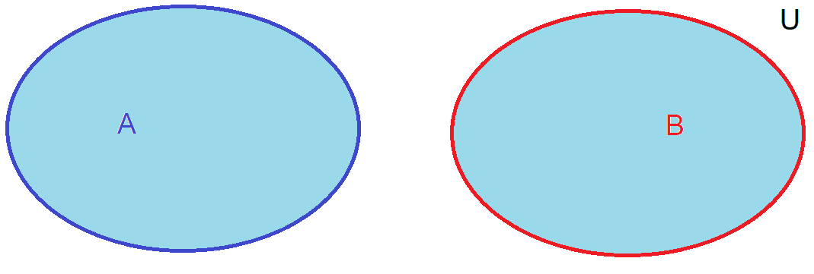
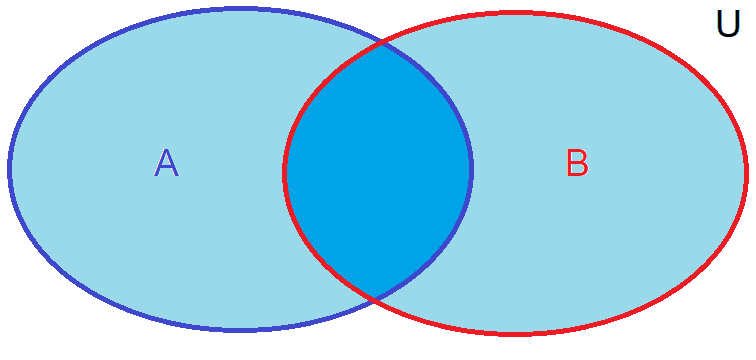
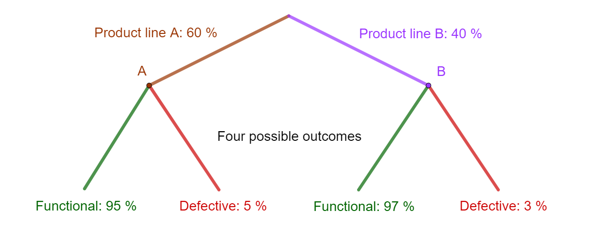

# {index}`Rules of probability`
For starters...

Since the examples below deal with a standard 52-deck of cards, the four suits are spades, hearts, clubs and diamonds, as seen in the figure below. Each suit includes 13 ranks: ten numeral cards (1 = Ace, 2, 3, ..., 10) and three face cards (King, Queen and Jack). Depending on a game, the ace can also have the rank of 14.

<p><a href="https://commons.wikimedia.org/wiki/File:Piatnikcards.jpg#/media/File:Piatnikcards.jpg"></a><br><a href="https://creativecommons.org/licenses/by/3.0" title="Creative Commons Attribution 3.0">CC BY 3.0</a>, <a href="https://commons.wikimedia.org/w/index.php?curid=7104281">Link</a></p>

Basic rules of probability are **Addition rule** and **Complement rule**.

## {index}`Addition rule`
Depending on whether both events can occur at the same time, or does one event exclude the other, the addition rule can have two outcomes.

When events $A$ and $B$ cannot occur at the same time or they are mutually exclusive, the probabilites can be added together since the events are different cases.

$P(A \cup B)=P(A)+P(B)$

$P(A \ \text{or} \ B)=P(A)+P(B)$

```{figure-md} addition_rule


Separate elementary events are both counted since the other cannot happen if the other one does.
```

**Example.** A random card is picked from the deck. What are the odds that the card is either spaces or diamonds?

<br></br>

When events $A$ and $B$ can occur at the same time, or they have common elements, the same events would be counted twice. Therefore the union of $P(A)$ and $P(B)$ must be subtracted.

$P(A \cup B)=P(A)+P(B)-(P(A) \cap P(B))$

$P(A \ \text{or} \ B)=P(A)+P(B)-(P(A) \ \text{and} \ P(B))$

```{figure-md} addition_rule_conditional


Common elementary events are counted twice unless they are subtracted.
```

**Example.** A random card is picked from the deck. What are the odds that the card is spaces or a face card?

:::{admonition} EXERCISE 1. Two dices
:class: tip, dropdown
In a board game, two six-sided dices are cast. The player wins a prize, if the faces of the dice are the same or the sum of the faces is 7 or 11. If the player doesn't win the prize, the player can try once again. What is the probability that the player wins the prize?
:::

:::{admonition} EXERCISE 2. Oh no more balls!
:class: tip, dropdown
The are 7 red balls, 4 blue balls and 5 white balls in box. Two balls are randomly picked. What is the probability that the balls are red and white?
:::
<br></br>

## {index}`Complement rule`
Since an event $A$ and its complementary event $\overline{A}$ are separate and mutually exclusive events, based on the additivity of probabilities, we have that 

$\begin{align}P(A \cup \overline{A})&=P(A)+P(\overline{A}) \\ \\
1&=P(A)+P(\overline{A}) \\ \\
P(A)&=1-P(\overline{A})\end{align}$

If you know the chance of something occurring, then you can easily find the chance of it not occurring by subtracting the probability of it happening from 1, as the sum of the probabilities of an event and its complement is always 1. The complement rule can be spesifically useful in cases, where the question is about "at least" or "no more than".

**Example.** Three cards are picked from the deck. What are the odds that at least one card is a face card?

:::{admonition} EXERCISE 3. Birthday on same weekday
:class: tip, dropdown
What is the probability that at least two persons of four are born on the same weekday?
:::
<br></br>

## {index}`Conditional probability`
The conditional probability is probability of event $A$ happening given that event $B$ has already occurred is denoted as $P(A|B)$. The conditional probability of event $A$ given event $B$ can be calculated using the formula

$P(A|B) = \frac{P(A \cap B)}{P(B)}$, where
- $P(A|B)$ is the conditional probability of event $A$ given event $B$.
- $P(A \cap B)$ is the probability of both events $A$ and $B$ occurring simultaneously, the intersection of $A$ and $B$.
- $P(B)$ is the probability of event $B$ occurring.

```{figure-md} addition_rule_conditional


The intersection of $A$ and $B$.
```

The idea behind conditional probability is that the probability of event A happening can change depending on whether event B has already occurred. It's like updating the knowledge or information about the situation.

## {index}`General multiplication rule`
From the formula of conditional probability we can write the **general multiplication rule** as:

$P(A \cap B) = P(A|B) \cdot {P(B)}$

**Example.** Two cards are drawn from a deck of cards. What is the probability that both cards are aces?

There are 52 cards in the deck, with 4 of them being aces. After the first ace is drawn, there are 51 cards left in the deck, with 3 of them being aces. Let's calculate the probability that both cards are aces.

$\begin{align} P(\text{both cards are aces}) &= P(\text{first card is an ace AND second card is an ace}) \\ \\
&= P(\text{first card is an ace}) \times P(\text{second card is an ace}) \\ \\
&= \frac{4}{52} \times \frac{3}{51} \\ \\
&= \frac{1}{13} \times \frac{1}{17} \\ \\
&= \frac{1}{221} \end{align}$

So, the probability that both cards drawn are aces is $\frac{1}{221} \approx 0.0045$.

**Example.** A hand of cards is two red aces, two black fives and a three of hearts. The three is given away and one card is taken from the deck. What it the probability that the card is an ace?

:::{admonition} EXERCISE 4. One card drawn from the deck, when...
:class: tip, dropdown
One card is drawn from the deck. What are the odds that the card is a two of spades, when

a) four cards are already drawn from the deck?

b) the ace of spades is already drawn and the card drawn is black?
:::

## {index}`Law of total probability`
The Law of total probability provides a way to calculate the probability of an event by considering *all possible ways* or conditions under which it *could* happen. It states that if you have a partition (or a mutually exclusive and exhaustive set) of events $B_1, \ B_2, \ \ldots, \ B_n$, then the probability of event $A$ can be calculated by summing the probabilities of $A$ given each of the events in the partition, weighted by the probability of each event in the partition.

Mathematically, if $B_1, \ B_2, \ \ldots, \ B_n$ form a partition of the sample space (meaning they are mutually exclusive and exhaustive), then the Law of total probability states:

$P(A) = \sum_{i=1}^{n} P(A|B_i) \times P(B_i)$

In simpler terms, this means that the probability of event $A$ occurring is equal to the sum of the probabilities of $A$ occurring given each possible condition (each event in the partition), multiplied by the probability of each condition occurring.

**Example.** Factory with production lines A and B

Suppose you are considering a factory with two production lines, A and B, that produce the same product. Line A produces 60 % of the total output, while line B produces the remaining 40 %. However, line A has a defective rate of 5 %, while line B has a defective rate of only 3 %.

What is the probabilit that a randomly selected product from the overall production is defective?

To apply the law of total probability, we can partition the sample space into two events. The product is selected either form product line A $(B_A)$ or from product line B $(B_B)$. These events are mutually exclusive and exhaustive since every product must come from either product line A or B. This can be presented by a tree model.

```{figure-md} total_law_prob


All possible different outcomes for a product from a factory, which has 2 product lines, as a tree model.
```

Now we can calculate the probability of a product being defective using the law of total probability:

$P(\text{Defective}) = P(\text{Defective} | B_A) \cdot P(B_A) + P(\text{Defective} | B_B) \cdot P(B_B)$

where
- $P(\text{Defective} | B_A)$ is the probability that a product is defective given that it came from Factory A, which is 0.05.
- $P(B_A)$ is the probability of selecting a product from Factory A, which is 0.60.
- $P(\text{Defective} | B_B)$ is the probability that a product is defective given that it came from Factory B, which is 0.03.
- $P(B_B)$ is the probability of selecting a product from Factory B, which is 0.40.

Substituting these values in the formula we get

$\begin{align} P(\text{Defective}) &= (0.05 \cdot 0.60) + (0.03 \cdot 0.40) \\ \\
P(\text{Defective}) &= 0.03 + 0.012 \\ \\
P(\text{Defective}) &= 0.042 \end{align}$

So, the probability of selecting a defective product is 0.042.

:::{admonition} EXERCISE 5. Passing a test depends of many factors.
:class: tip, dropdown
Let's assume that a student's success in an exam depends heavily on the time of day the exam is held. If the exam is early in the morning, the probability of passing is only 40 %. If it's in the afternoon, the student passes with a probability of 90 %. The teacher schedules the exam with a 30 % probability in the morning and a 70 % probability in the afternoon. What is the probability of passing the exam considering these two factors?
:::

## {index}`Bayes' theorem`
Bayes' theorem describes how to update the probability of a hypothesis in light of *new evidence or information*. It's named after the Reverend Thomas Bayes, an 18th-century British mathematician. Bayes' theorem is particularly useful in situations where we want to infer the probability of a hypothesis given observed data.

Bayes' theorem can be stated as follows

$P(A|B) = \frac{P(B|A) \cdot P(A)}{P(B)}$

where
- $P(A|B)$ is the probability of event A occurring given that event B has occurred (this is called the posterior probability).
- $P(B|A)$ is the probability of event B occurring given that event A has occurred (this is called the likelihood).
- $P(A)$ is the prior probability of event A (the probability of A occurring before considering any new evidence).
- $P(B)$ is the prior probability of event B (the probability of B occurring before considering any new evidence).

In simpler terms, Bayes' theorem allows us to update our belief in the probability of a hypothesis (A) based on observed data (B).

**Example.** In another factory, bulbs are manufactured on two different production lines, line A and line B. 70% of the production comes from line A and 30% from line B. Of the bulbs from line A, 4% are defective, and of the bulbs from line B, 2% are defective. A customer complains about a defective bulb, and the management cannot determine from which line it originated. Calculate the probability that the defective bulb came from line A."

:::{admonition} EXERCISE 6. Dirty sports
:class: tip, dropdown
Let's assume that in a sports competition, 0.2 % of the participants use doping. The use of substances is tested through a blood test. If the substance being tested for is present in the blood, a positive result is obtained with a probability of 99 %. However, the test is somewhat uncertain in a sense that a positive result can be obtained with a probability of 5 % even if the substance is not present in the blood. What is the probability that a person who receives a positive test result is using a prohibited substance?
:::

## {index}`Chain rule`